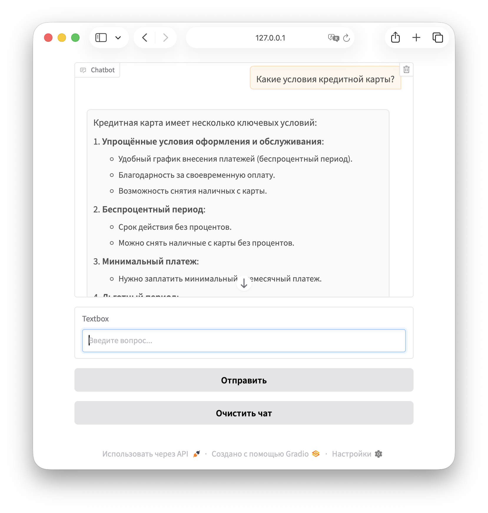
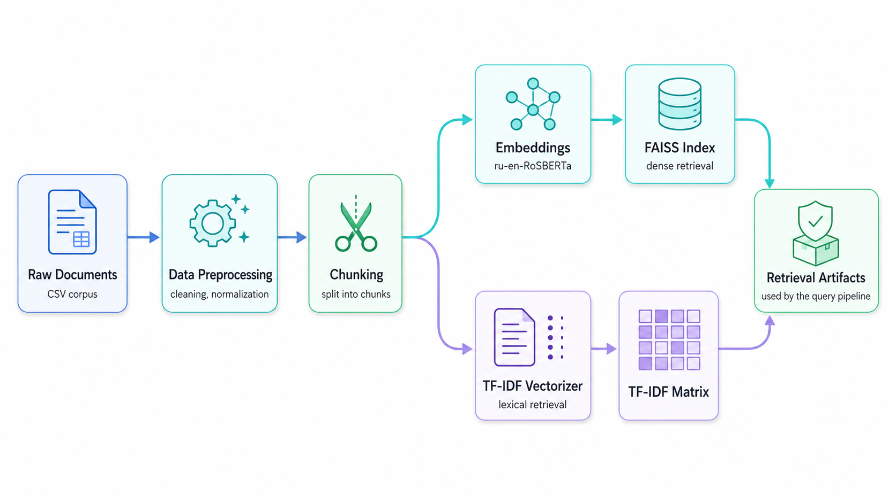
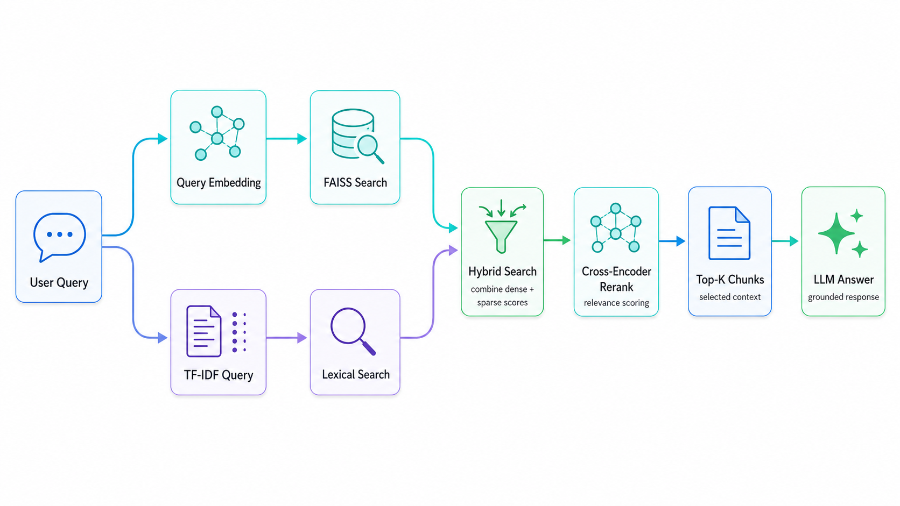

<div align="center">

# AURA

### Augmented Universal Retrieval Assistant

**Гибридная RAG-система для поиска информации и генерации ответов по документам**

[](https://www.python.org/)
[](https://github.com/facebookresearch/faiss)
[](https://huggingface.co/docs/transformers)
[](https://www.gradio.app/)

</div>

<p align="center">
  
</p>

<p align="center">
  <em>Интерфейс AURA для поиска информации по документам с использованием гибридного RAG-пайплайна.</em>
</p>

---

## О проекте

**AURA — Augmented Universal Retrieval Assistant** — гибридная RAG-система для поиска релевантной информации в корпусе документов и генерации ответа на основе найденного контекста.

Проект разработан в рамках хакатона **«Альфа-Будущее» от Альфа-Банка**.

AURA объединяет несколько подходов к поиску:

* семантический поиск по эмбеддингам;
* лексический поиск с помощью TF-IDF;
* гибридное объединение результатов;
* повторное ранжирование документов с помощью Cross-Encoder;
* генерацию ответа на основе выбранных фрагментов;
* интерактивный интерфейс на Gradio.

Основная идея системы — использовать быстрый поиск для отбора кандидатов, а затем более точную модель для финальной сортировки найденных документов.

---

## Возможности

* Гибридный поиск по документам: FAISS + TF-IDF.
* Семантический поиск по смыслу пользовательского запроса.
* Лексический поиск по точным совпадениям терминов.
* Cross-Encoder reranking для улучшения порядка найденных фрагментов.
* Генерация ответа на основе релевантного контекста.
* Интерактивный веб-интерфейс на Gradio.
* Настраиваемый retrieval-пайплайн через `.env`.

---

## Архитектура

### Индексация документов

<p align="center">
  
</p>

На этапе индексации система:

1. загружает исходный корпус документов;
2. очищает и нормализует текст;
3. разбивает документы на чанки;
4. строит плотные векторные представления;
5. создаёт FAISS-индекс;
6. формирует TF-IDF-представление корпуса.

### Обработка пользовательского запроса

<p align="center">
  
</p>

При обработке пользовательского запроса система:

1. строит embedding запроса;
2. выполняет поиск в FAISS;
3. преобразует запрос через TF-IDF;
4. выполняет лексический поиск;
5. объединяет результаты двух методов;
6. повторно ранжирует кандидатов;
7. выбирает Top-K чанков;
8. генерирует ответ по найденному контексту.

---

## Как работает AURA

### 1. Предобработка данных

Исходные документы очищаются и приводятся к единому формату.

На этом этапе выполняются:

* очистка текста;
* удаление лишних символов;
* нормализация строк;
* подготовка данных к дальнейшему разбиению.

---

### 2. Chunking

Документы разбиваются на небольшие смысловые фрагменты — чанки.

Это позволяет:

* находить конкретные части документов;
* уменьшать объём нерелевантного контекста;
* не передавать в языковую модель весь документ;
* повысить точность retrieval-пайплайна.

---

### 3. Dense Retrieval

Для семантического поиска используется embedding-модель:

```text
ai-forever/ru-en-RoSBERTa
```

Каждый чанк преобразуется в плотный вектор.

Для поиска ближайших документов используется **FAISS**.

Dense Retrieval позволяет находить:

* документы, близкие по смыслу;
* перефразированные формулировки;
* тематически связанные фрагменты;
* ответы без полного совпадения ключевых слов.

---

### 4. Sparse Retrieval

Для лексического поиска используется **TF-IDF** из библиотеки Scikit-learn.

TF-IDF учитывает точные совпадения слов между запросом и документами.

Этот подход особенно полезен для поиска:

* названий продуктов;
* финансовых терминов;
* аббревиатур;
* числовых значений;
* точных формулировок.

---

### 5. Hybrid Search

Результаты FAISS и TF-IDF объединяются в единую оценку релевантности.

```text
hybrid_score =
    alpha × dense_score
    + (1 - alpha) × sparse_score
```

где:

* `dense_score` — оценка семантической близости;
* `sparse_score` — оценка TF-IDF;
* `alpha` — вес семантического поиска.

Гибридный поиск объединяет преимущества двух подходов.

| Метод | Преимущество | Ограничение |
| --- | --- | --- |
| FAISS | Находит документы по смыслу | Может пропускать точные термины |
| TF-IDF | Находит точные совпадения | Не учитывает перефразирование |
| Hybrid Search | Объединяет оба сигнала | Требует настройки веса `alpha` |

---

### 6. Cross-Encoder Reranking

После первичного поиска лучшие кандидаты передаются Cross-Encoder модели:

```text
DiTy/cross-encoder-russian-msmarco
```

Модель получает пару:

```text
(query, chunk)
```

и вычисляет итоговую оценку релевантности.

Cross-Encoder анализирует запрос и документ совместно, поэтому обеспечивает более точную сортировку, чем поиск только по близости эмбеддингов.

Reranking позволяет:

* улучшить порядок документов;
* убрать менее релевантные результаты;
* повысить качество Top-K;
* передать языковой модели более точный контекст.

---

### 7. Answer Generation

После reranking выбираются лучшие чанки.

```text
Top-K chunks → Context → LLM → Answer
```

Найденные документы объединяются в контекст, который передаётся языковой модели.

Ответ формируется на основе информации из выбранных фрагментов корпуса.

---

## Используемые модели

### Embedding Model

```text
ai-forever/ru-en-RoSBERTa
```

Используется для:

* кодирования документов;
* кодирования пользовательских запросов;
* семантического поиска.

### Reranker

```text
DiTy/cross-encoder-russian-msmarco
```

Используется для повторной сортировки документов после гибридного поиска.

### Language Model

```text
HuggingFaceTB/SmolLM3-3B
```

Используется для генерации итогового ответа на основе найденного контекста.

---

## Структура проекта

```text
AURA/
│
├── data/
│   ├── raw/
│   ├── processed/
│   └── chunks/
│
├── images/
│   ├── interface.png
│   ├── indexing_pipeline.png
│   └── query_pipeline.png
│
├── scores/
│
├── src/
│   ├── chunking/
│   ├── config/
│   ├── data_preprocessing/
│   ├── embeddings/
│   ├── evaluation/
│   ├── pipeline/
│   │   └── rag_pipeline.py
│   ├── vector_store/
│   └── main.py
│
├── queries_rag_results.csv
├── requirements.txt
└── README.md
```

---

## Технологический стек

| Категория | Технологии |
| --- | --- |
| Язык | Python |
| NLP | Transformers, Sentence Transformers |
| Vector Search | FAISS |
| Sparse Retrieval | TF-IDF, Scikit-learn |
| Data Processing | Pandas, NumPy |
| Interface | Gradio |
| LLM Integration | Hugging Face |

---

## Установка

### 1. Клонирование репозитория

```bash
git clone https://github.com/Eg0Mak/AURA.git
cd AURA
```

### 2. Создание виртуального окружения

Linux / macOS:

```bash
python3 -m venv .venv
source .venv/bin/activate
```

Windows:

```bash
python -m venv .venv
.venv\Scripts\activate
```

### 3. Установка зависимостей

```bash
pip install --upgrade pip
pip install -r requirements.txt
```

При первом запуске используемые модели будут загружены автоматически.

---

## Подготовка данных

Исходные данные необходимо разместить в директории:

```text
data/raw/
```

Pipeline выполняет:

1. загрузку исходного корпуса;
2. предварительную обработку;
3. сохранение очищенных данных;
4. разбиение документов на чанки;
5. построение эмбеддингов;
6. создание FAISS-индекса;
7. построение TF-IDF-представления.

---

## Конфигурация

Создайте файл `.env` в корневой директории проекта.

Пример конфигурации:

```env
# === Пути данных ===
RAW_DATA_DIR=data/raw
PROCESSED_DATA_DIR=data/processed
CHUNKS_DIR=data/chunks

# === Настройки RAG ===
TOP_K_RERANK=5
FAISS_TOP_N=11
TFIDF_TOP_N=11
CHUNK_SIZE=600
CHUNK_OVERLAP=100
HYBRID_ALPHA=0.6

# === Модели ===
EMBEDDING_MODEL_NAME=ai-forever/ru-en-RoSBERTa
RERANK_MODEL_NAME=DiTy/cross-encoder-russian-msmarco
LLM_MODEL_NAME=HuggingFaceTB/SmolLM3-3B
```

### Основные параметры

| Переменная | Значение по умолчанию | Описание |
| --- | ---: | --- |
| `RAW_DATA_DIR` | `data/raw` | Директория с исходными данными |
| `PROCESSED_DATA_DIR` | `data/processed` | Директория с очищенными данными |
| `CHUNKS_DIR` | `data/chunks` | Директория для сохранения чанков |
| `TOP_K_RERANK` | `5` | Количество документов, возвращаемых после Cross-Encoder reranking |
| `FAISS_TOP_N` | `11` | Количество кандидатов, получаемых из FAISS |
| `TFIDF_TOP_N` | `11` | Количество кандидатов, получаемых с помощью TF-IDF |
| `CHUNK_SIZE` | `600` | Максимальный размер одного чанка |
| `CHUNK_OVERLAP` | `100` | Размер пересечения между соседними чанками |
| `HYBRID_ALPHA` | `0.6` | Вес семантической оценки при объединении FAISS и TF-IDF |
| `EMBEDDING_MODEL_NAME` | `ai-forever/ru-en-RoSBERTa` | Модель для построения эмбеддингов документов и запросов |
| `RERANK_MODEL_NAME` | `DiTy/cross-encoder-russian-msmarco` | Cross-Encoder модель для повторного ранжирования кандидатов |
| `LLM_MODEL_NAME` | `HuggingFaceTB/SmolLM3-3B` | Языковая модель для генерации итогового ответа |

Значение `HYBRID_ALPHA=0.6` означает, что при гибридном поиске больший вес получает семантическая оценка FAISS, а оставшаяся часть приходится на TF-IDF:

```text
hybrid_score =
    0.6 × dense_score
    + 0.4 × sparse_score
```

Размер чанка и пересечение между соседними фрагментами задаются параметрами `CHUNK_SIZE` и `CHUNK_OVERLAP`.

---

## Запуск

Запустите Gradio-интерфейс из корневой директории проекта:

```bash
python -m src.main
```

После инициализации моделей в терминале появится адрес локального веб-интерфейса.

Через интерфейс можно:

* вводить пользовательские запросы;
* получать ответы от RAG-системы;
* просматривать историю диалога;
* очищать текущий чат.

---

## Использование Pipeline из Python

```python
import asyncio

from src.pipeline.rag_pipeline import RAGPipeline


async def main() -> None:
    pipeline = RAGPipeline()
    pipeline.load()

    query = "Какие условия действуют по кредитной карте?"
    answer = await pipeline.run_pipeline(query)

    print(answer)


if __name__ == "__main__":
    asyncio.run(main())
```

---

## Настройка Hybrid Search

Параметр `HYBRID_ALPHA` определяет баланс между семантическим и лексическим поиском.

Больший вес FAISS:

```env
HYBRID_ALPHA=0.8
```

Равный вклад обоих методов:

```env
HYBRID_ALPHA=0.5
```

Больший вес TF-IDF:

```env
HYBRID_ALPHA=0.3
```

Оптимальное значение зависит от структуры корпуса и типов пользовательских запросов.

---

## Оценка качества

В проекте предусмотрен модуль оценки retrieval-пайплайна.

Для анализа качества поиска могут использоваться следующие метрики.

### Hit@K

Показывает, найден ли хотя бы один релевантный документ среди первых `K` результатов.

```text
Hit@K = 1, если релевантный документ найден в Top-K
Hit@K = 0, если релевантный документ не найден
```

### Recall@K

Показывает долю релевантных документов, попавших в Top-K.

```text
Recall@K =
    количество найденных релевантных документов
    /
    общее количество релевантных документов
```

### Precision@K

Показывает долю релевантных документов среди первых `K` результатов.

```text
Precision@K =
    количество релевантных документов в Top-K
    /
    K
```

### MRR

Оценивает позицию первого релевантного документа.

```text
MRR = mean(1 / rank)
```

где `rank` — позиция первого релевантного результата.

---

## Почему используется гибридный поиск

Семантический поиск хорошо работает с перефразированными запросами, но может пропускать точные термины.

TF-IDF хорошо находит совпадения слов, но не учитывает общий смысл запроса.

Например, запрос:

```text
Льготный период по карте Alfa Travel
```

содержит одновременно:

* точное название продукта;
* финансовый термин;
* смысловую формулировку вопроса.

FAISS помогает находить документы по смыслу, а TF-IDF сохраняет чувствительность к точным словам.

---

## Почему reranking выполняется отдельно

На первом этапе необходимо быстро найти кандидатов среди большого количества документов.

Для этого используются FAISS и TF-IDF.

На втором этапе Cross-Encoder более точно оценивает уже ограниченный набор найденных чанков.

```text
Fast Retrieval → Accurate Reranking
```

Такой подход позволяет сохранить приемлемую скорость поиска и повысить качество финальной выдачи.

---

## Результат

AURA реализует полный RAG-пайплайн: от подготовки документов и построения индексов до гибридного поиска, reranking и генерации ответа.

Проект демонстрирует практическое применение современных NLP-подходов для поиска информации в документах и построения интерактивного ассистента на базе retrieval-augmented generation.
